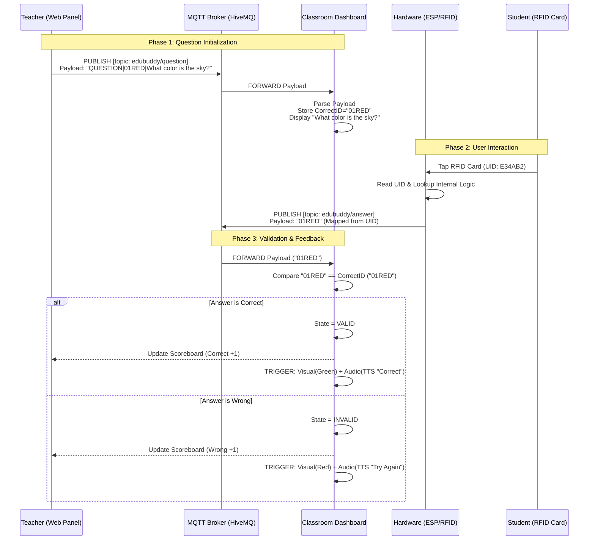

# Smart EduBuddy: Technical System Specification

**Version:** 1.0.0
**Date:** 2025-12-24
**System Classification:** IoT-Based Interactive Educational Tool

---

## 1. System Architecture Workflow

The following Sequence Diagram illustrates the precise data flow and handshake protocols between the User Interface (Teacher Panel), the MQTT Broker, the Hardware Controller (ESP32/NodeMCU), and the Display Interface (Dashboard).

---

## 2. Hardware Electrical Specification

### 2.1 Microcontroller Unit (MCU)
The system utilizes either the **NodeMCU v1.0 (ESP8266 Core)** or **ESP32 Dev Module** as the central processing unit. The MCU handles Wi-Fi connectivity (IEEE 802.11 b/g/n) and communicates with the RFID peripheral via the SPI protocol.

### 2.2 Pin Interfacing (SPI Protocol)

The following table details the hardwired connections required for the **MFRC522 RFID Reader**.

| Signal Name | Function | NodeMCU (ESP8266) Pin | ESP32 GPIO Pin | Wire Color Code (Std) |
| :--- | :--- | :--- | :--- | :--- |
| **SDA (SS)** | Chip Select (Slave Select) | **D4** (GPIO 2) | **GPIO 5** | Blue |
| **SCK** | Serial Clock | **D5** (GPIO 14) | **GPIO 18** | Orange |
| **MOSI** | Master Out Slave In | **D7** (GPIO 13) | **GPIO 23** | Green |
| **MISO** | Master In Slave Out | **D6** (GPIO 12) | **GPIO 19** | Pink |
| **RST** | Reset | **D3** (GPIO 0) | **GPIO 22** | Purple |
| **GND** | Ground Reference | **GND** | **GND** | Black/Brown |
| **3.3V** | Power Supply (VCC) | **3V3** | **3V3** | Red |
| **IRQ** | Interrupt Request | *Not Connected* | *Not Connected* | *N/A* |

> **⛔ CRITICAL HARDWARE WARNING:** 
> The MFRC522 module operates strictly at **3.3V Logic Levels**. 
> - **DO NOT** connect the VCC pin to 5V (Vin/USB). 
> - Connecting to 5V will result in immediate thermal damage to the RFID IC.

---

## 3. Communication Protocol Specification

 The system utilizes **MQTT (Message Queuing Telemetry Transport)** over WebSockets (Port 8884) for real-time, low-latency communication.

### 3.1 Topic Definition structure
- **Root Namespace:** `edubuddy/`
- **QoS Level:** 0 (At most once) or 1 (At least once)

| Topic | Direction | Payload Structure | Description |
| :--- | :--- | :--- | :--- |
| `edubuddy/question` | Teacher -> Dashboard | `QUESTION|<AnswerID>|<QuestionText>` | Initiates a new game state. |
| `edubuddy/answer` | MCU -> Dashboard | `<CardID>` (e.g., "01RED") | Transmits student input. |
| `edubuddy/status` | MCU -> System | `"online"` / `"offline"` | Heartbeat/Availability check. |

---

## 4. Test Configuration (Bypass Mode)

For development and circuit validation without RF hardware, discrete tactile switches (push buttons) may be utilized to simulate logic states.

**Schematic for Simulation Mode (Internal Pull-Up):**
*   **Switch A (Simulates Answer A):** Connect between **D1 (GPIO 5)** and **GND**.
*   **Switch B (Simulates Answer B):** Connect between **D2 (GPIO 4)** and **GND**.

*Firmware logic automatically debounces these inputs and publishes the corresponding pre-defined Answer IDs.*
